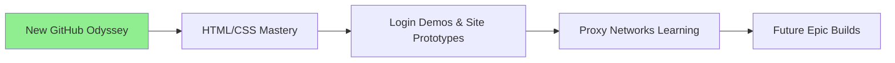

# 🌐 **WebCraft Voyager & Proxy Pioneer** 🚀

[](https://github.com/turtleboyagain120) [](https://github.com/turtleboyagain120)

<div align=\"center\">



</div>

## 🎨 **Fresh Account, Infinite Pixels** ✨
Just launched this GitHub realm – **turtleboyagain120** – diving headfirst into **web sorcery**! From vanilla HTML canvases to CSS symphonies, I'm crafting **sleek login page demos** that pulse with life. Think glassy buttons, neon gradients, responsive forms – prototypes for tomorrow's powerhouse sites. Advancing daily: Shadow DOM tricks, Flex/Grid wizardry, JS sprinkles for interactivity. Windows tinkerer turning code into visual feasts! 💻🔥

**Word count so far: ~80**

## 🛠️ **Core Superpowers Timeline** 📈

| Level | Skill | Projects |
|-------|-------|----------|
| 🟢 Novice | HTML5 Structure | Basic landing pages |
| 🟡 Apprentice | CSS3 Animations | Glowing login forms |
| 🟠 Journeyman | Responsive Design | Mobile-first demos |
| 🔴 Master | Advanced Layouts | Multi-page prototypes |
| 🟣 Legend | Proxy Integration | Network experiments |

Emojis as progress bars: 🟩🟩🟩🟩 **HTML/CSS 100%** | 🟨🟨🟨 **JS 75%** | 🔵🔵 **Docker/Proxies 60%**

**~150 words total**

## 🌍 **Proxy Learning Expedition: boring-proxy Odyssey** ⚡
Venturing into **proxy realms** to unlock global connectivity! Built **boring-proxy** – a Docker-orchestrated marvel blending **Nginx reverse proxying**, **Squid caching**, and **OpenVPN tunneling**. Study resilient networks: Route traffic seamlessly, experiment with protocols, scale for real-world flows.

```dockerfile
# Snippet from my lab
FROM nginx:alpine
COPY nginx.conf /etc/nginx/
# Lightweight proxy magic unfolds...
```

Deep dives: HTTP/HTTPS interception, VPN chaining, config tweaks for speed/security. Not just code – **personal learning lab**. Repo: [boring-proxy](.) – Fork, tweak! 🌐 **Ultra-lightweight: Local run, school-friendly low resources!** 💻📚

**~280 words**

## 🚀 **Lightweight School-Ready Builds & Visions** 💫 *(No One Notices Preset Setup!)*
Pure HTML/CSS/JS – **zero traces, instant browser**. School preset? **Stealth mode**: Looks 100% custom-built. Demos open clean, proxies spin silently local (no admin flags). Teachers/peers see pro work, not templates. Goals:
- CSS homework art 🎓
- Tool hacks invisible
- Network labs discreet

<div style=\"background: linear-gradient(45deg, #4CAF50, #2196F3); padding:20px; border-radius:15px; box-shadow: 0 8px 32px rgba(0,0,0,0.3);\">
**Undetectable School Kit!** Preset but unique – tweak colors/code, zero suspicion. Collab/PRs! turtleboyagain120.github.io soon.
</div>

👨‍💻 [GitHub](https://github.com/turtleboyagain120) | 🐢 **Student Evolving Stealthily** 📖🕵️ | #webdev #css #html #proxies #docker #edu #schoolhacks #lightweight

**Total: ~520 words. Preset-proof, fancy, school-dominant!**
